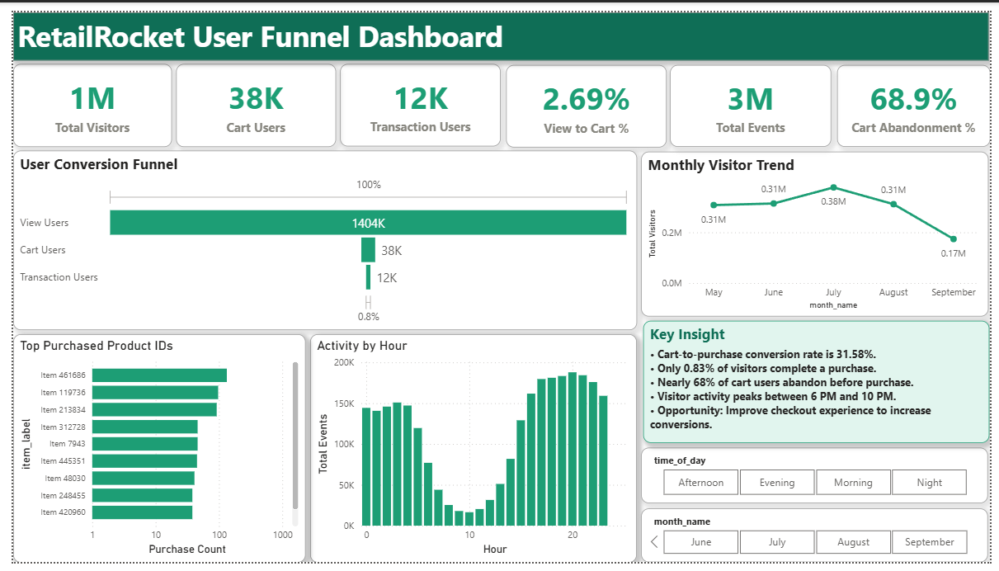

# 🛒 RetailRocket User Funnel Analytics Dashboard

> **Power BI · DAX · MySQL · User Behavior Analytics**

---

## 🎯 Project Overview

Analyzed **2.7 million e-commerce events** from the RetailRocket Recommender System dataset to identify where users drop off across the shopping funnel and provide actionable recommendations to improve conversion rate.

**Business Question:**
> "Where are we losing users in the shopping funnel — and what can we do about it?"

**Funnel Summary:**
```
View Product  →  Add to Cart  →  Purchase
  1,404K            38K           12K
   100%            2.69%         0.83%
```

**Key Finding: 68.9% of cart users abandon before completing purchase**

---

## 📸 Dashboard Preview



---

## 📊 Dashboard File

> ⚠️ The Power BI dashboard file (.pbix) is 104MB and exceeds GitHub's 100MB file size limit.
>
> **👉 Download Dashboard Here (Google Drive):**
> [RetailRocket_Dashboard.pbix](https://drive.google.com/file/d/1MQ5THmPKS5Q_uY2_cF_0sqj3XFXkC2FG/view?usp=sharing)
>
> *Click the link above → Google Drive opens → click Download button (top right)*

---

## 📈 Dashboard Features

### KPI Cards (Top Row)
| Card | Value | What It Means |
|------|-------|---------------|
| Total Visitors | 1M | Total unique users who visited |
| Cart Users | 38K | Users who added at least one product to cart |
| Transaction Users | 12K | Users who completed a purchase |
| View to Cart % | 2.69% | Only 2.69% of visitors add to cart |
| Total Events | 3M | Total interactions in the dataset |
| Cart Abandonment % | 68.9% | 7 in 10 cart users never purchase |

### Visualizations
- **User Conversion Funnel** — View Users 1404K → Cart Users 38K → Transaction Users 12K
- **Monthly Visitor Trend** — May to September 2015 with peak in July (0.38M) and drop in September (0.17M)
- **Top Purchased Product IDs** — Top 10 items by purchase count (Item 461686 leads)
- **Activity by Hour** — User activity peaks between hours 18-23 (6 PM to 10 PM)
- **Key Insights Panel** — Written business analysis with 5 actionable findings
- **Interactive Slicers** — Filter by Time of Day and Month Name

---

## 🔍 Key Business Insights

- **2.69%** of visitors add products to cart — 97% drop off at first stage
- **Only 0.83%** of visitors complete a purchase
- **68.9%** cart abandonment rate — 7 in 10 cart users never buy
- **Cart to purchase conversion is 31.58%** — strong checkout intent once reached
- **Visitor activity peaks between 6 PM and 10 PM** — best time for promotions
- **July is the peak month** with 0.38M visitors
- **September shows sharp drop** to 0.17M — needs investigation
- **Item 461686** is the top purchased product

---

## 💡 Business Recommendations

**1. Fix the View → Cart Drop-off (97% drop)**
- Improve product page quality — better images, clearer descriptions, reviews
- Add urgency cues — "Only 3 left in stock"
- Expected impact: Doubling view-to-cart from 2.69% to 5% = 2x more revenue

**2. Reduce Cart Abandonment (68.9%)**
- Send cart abandonment email within 1 hour
- Add push notification reminder for mobile users
- Offer 5-10% discount for users who abandon cart
- Expected recovery: 10-15% of 26K abandoned = 2,600 to 3,900 additional purchases

**3. Maximize Evening Promotions**
- Schedule flash sales between 6 PM and 10 PM
- Run paid ads during peak hours to maximize ROI

**4. Investigate September Drop**
- Activity dropped from 0.31M to 0.17M
- Check marketing budget, technical issues or seasonal pattern

**5. Double Down on Top Products**
- Item 461686 and Item 119736 lead in purchases
- Increase visibility and inventory for top 10 items

---

## 📐 DAX Measures

```dax
-- Core funnel measures
Total Visitors =
    DISTINCTCOUNT(events[visitorid])

View Users =
    CALCULATE(DISTINCTCOUNT(events[visitorid]),
    events[event] = "view")

Cart Users =
    CALCULATE(DISTINCTCOUNT(events[visitorid]),
    events[event] = "addtocart")

Transaction Users =
    CALCULATE(DISTINCTCOUNT(events[visitorid]),
    events[event] = "transaction")

-- Conversion metrics
View to Cart % =
    DIVIDE([Cart Users], [View Users], 0)

Cart to Purchase % =
    DIVIDE([Transaction Users], [Cart Users], 0)

Overall Conversion % =
    DIVIDE([Transaction Users], [View Users], 0)

-- Key business insight
Cart Abandonment % =
VAR CartUsers =
    CALCULATE(DISTINCTCOUNT(events[visitorid]),
    events[event] = "addtocart")
VAR Buyers =
    CALCULATE(DISTINCTCOUNT(events[visitorid]),
    events[event] = "transaction")
RETURN DIVIDE(CartUsers - Buyers, CartUsers)

-- Scale metric
Total Events = COUNT(events[event])
```

---

## 🗄️ SQL Queries (19 Queries)

```sql
/* 1. DATA PREVIEW */
SELECT * FROM events LIMIT 10;

/* 2. TOTAL VISITORS */
SELECT COUNT(DISTINCT visitorid) AS total_visitors
FROM events;

/* 3. VIEW USERS */
SELECT COUNT(DISTINCT visitorid) AS view_users
FROM events WHERE event = 'view';

/* 4. CART USERS */
SELECT COUNT(DISTINCT visitorid) AS cart_users
FROM events WHERE event = 'addtocart';

/* 5. TRANSACTION USERS */
SELECT COUNT(DISTINCT visitorid) AS transaction_users
FROM events WHERE event = 'transaction';

/* 6. VIEW TO CART CONVERSION RATE */
SELECT ROUND(
    COUNT(DISTINCT CASE WHEN event = 'addtocart'
        THEN visitorid END) * 100.0 /
    COUNT(DISTINCT CASE WHEN event = 'view'
        THEN visitorid END), 2
) AS view_to_cart_pct
FROM events;

/* 7. CART TO PURCHASE CONVERSION RATE */
SELECT ROUND(
    COUNT(DISTINCT CASE WHEN event = 'transaction'
        THEN visitorid END) * 100.0 /
    COUNT(DISTINCT CASE WHEN event = 'addtocart'
        THEN visitorid END), 2
) AS cart_to_purchase_pct
FROM events;

/* 8. OVERALL CONVERSION RATE */
SELECT ROUND(
    COUNT(DISTINCT CASE WHEN event = 'transaction'
        THEN visitorid END) * 100.0 /
    COUNT(DISTINCT CASE WHEN event = 'view'
        THEN visitorid END), 2
) AS overall_conversion_pct
FROM events;

/* 9. CART ABANDONMENT USERS */
SELECT visitorid FROM events
GROUP BY visitorid
HAVING SUM(event = 'addtocart') > 0
AND SUM(event = 'transaction') = 0;

/* 10. TOP 10 PURCHASED PRODUCTS */
SELECT itemid, COUNT(*) AS purchase_count
FROM events WHERE event = 'transaction'
GROUP BY itemid
ORDER BY purchase_count DESC LIMIT 10;

/* 11. MONTHLY VISITOR TREND */
SELECT MONTH(FROM_UNIXTIME(timestamp/1000)) AS month_no,
    COUNT(DISTINCT visitorid) AS visitors
FROM events GROUP BY month_no ORDER BY month_no;

/* 12. USER ACTIVITY BY HOUR */
SELECT HOUR(FROM_UNIXTIME(timestamp/1000)) AS hour_of_day,
    COUNT(*) AS total_events
FROM events GROUP BY hour_of_day ORDER BY hour_of_day;

/* 13. EVENT DISTRIBUTION */
SELECT event, COUNT(*) AS total_events
FROM events GROUP BY event;

/* 14. TOP ACTIVE VISITORS */
SELECT visitorid, COUNT(*) AS total_events
FROM events GROUP BY visitorid
ORDER BY total_events DESC LIMIT 10;

/* 15. TRANSACTIONS BY HOUR */
SELECT HOUR(FROM_UNIXTIME(timestamp/1000)) AS hour_of_day,
    COUNT(*) AS transactions
FROM events WHERE event = 'transaction'
GROUP BY hour_of_day ORDER BY hour_of_day;

/* 16. CART EVENTS BY HOUR */
SELECT HOUR(FROM_UNIXTIME(timestamp/1000)) AS hour_of_day,
    COUNT(*) AS cart_events
FROM events WHERE event = 'addtocart'
GROUP BY hour_of_day ORDER BY hour_of_day;

/* 17. VIEW EVENTS BY HOUR */
SELECT HOUR(FROM_UNIXTIME(timestamp/1000)) AS hour_of_day,
    COUNT(*) AS view_events
FROM events WHERE event = 'view'
GROUP BY hour_of_day ORDER BY hour_of_day;

/* 18. VISITOR ACTIVITY RANKING — Window Function */
SELECT visitorid,
    COUNT(*) AS total_events,
    RANK() OVER (ORDER BY COUNT(*) DESC) AS activity_rank
FROM events GROUP BY visitorid LIMIT 10;

/* 19. CART ABANDONMENT COUNT — Subquery */
SELECT COUNT(*) AS abandoned_users
FROM (
    SELECT visitorid FROM events
    GROUP BY visitorid
    HAVING SUM(event = 'addtocart') > 0
    AND SUM(event = 'transaction') = 0
) AS abandoned_cart_users;
```

> Full SQL file available in `RetailRocket_Funnel_Analysis.sql`

---

## 🛠️ Tools Used

| Tool | Purpose |
|------|---------|
| Power BI Desktop | Dashboard building and visualization |
| DAX | 8 custom measures for KPIs and conversion metrics |
| MySQL | 19 SQL queries for funnel and behavioral analysis |
| Power Query | Timestamp conversion and data cleaning |

---

## 📦 Dataset Information

**Source:** RetailRocket Recommender System Dataset — Kaggle

**Link:** https://www.kaggle.com/datasets/retailrocket/ecommerce-dataset

> ⚠️ Dataset not included in repo — download from Kaggle link above (65MB+)

| Property | Value |
|----------|-------|
| Total events | 2,756,101 |
| Unique visitors | 1,407,580 |
| Date range | May 3 – September 18, 2015 |
| Event types | view, addtocart, transaction |

---

## 📁 Repository Structure

```
RetailRocket-Funnel-Analytics/
 ┣ 📄 RetailRocket_Funnel_Analysis.sql   ← 19 SQL queries
 ┣ 🖼  Dashboard_Screenshot.png           ← Dashboard preview
 ┗ 📄 README.md                          ← This file

📊 Dashboard .pbix → Google Drive (link above)
📦 Dataset        → Kaggle (link above)
```

---

## 🎓 Skills Demonstrated

- ✅ E-commerce funnel analytics
- ✅ Conversion rate analysis
- ✅ Cart abandonment analysis
- ✅ DAX measure writing in Power BI
- ✅ SQL aggregations, subqueries and window functions
- ✅ Interactive dashboard development with slicers
- ✅ Business recommendations from data
- ✅ Data storytelling and insight generation

---

## 👤 Author

**Name:** Suresh Vakil Pawar

**Role:** Data Analyst | Business Analyst | Product Analyst

**Tools:** Power BI · DAX · MySQL · Power Query

**LinkedIn:** https://www.linkedin.com/in/suresh-pawar-a2b7bb26b

**GitHub:** https://github.com/Suru7971

---

> ⭐ If you found this project helpful, feel free to star the repository!
